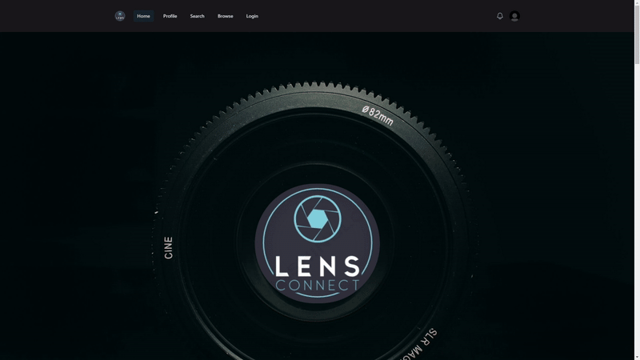
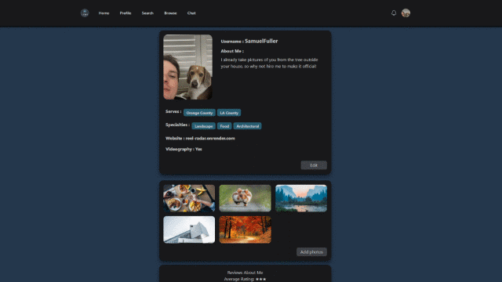

# LensConnect
 

 Deployed Link: https://lensconnect.netlify.app/
 
## Description
**This is the frontend of the LensConnect application, the backend can be found <a href="https://github.com/anduhrooo/lensconnect_back"> here</a>**

We at LensConnect recognize the challenges behind seeking talented photographers for work, and the struggle of gig-oriented photographers to find work. We seek to connect the two parties without the throughput of a large and expensive photographer booking or rental company. There is a genuine need in the photography industry to simplify and stream-line this process of hiring photographers, and fostering a connection between clients and talent.

LensConnect solves this through customizable portfolios for the talented photographers in one centralized and accessible platform. Photographers can exhibit important information for prospective clients, such as serviceable-locations, specialties, and a portfolio of images to express style and performance. Clients have the option to leave honest reviews of the photographers through the validation that services were performed to ensure honest reviews that add to the confidence and candor of both parties. 

Throughout the development of LensConnect we gained insight into the distinct uniqueness of both the photography industry and the complicated nuances of designing a user-centric platform. From styling to user customization every step was made to enrich our understanding of the needs of clients and talent and bridging the gap through the technology and languages of a web developer. 

## Table of Contents (Optional)

- [Installation](#installation)
- [Usage](#usage)
- [Credits](#credits)
- [Features](#features)
- [Questions](#questions)

## Installation
These steps are for if a user wishes to download the repo and run the application on their own local server.

1. Download, copy, or clone the code to your local machine through GitHub and open in a VSCode, or another appropriate Code Editor/IDE. 


3. Right-click on the file **'vite.config.js'** and select 'Open In Integrated Terminal' option in the drop-down menu, then run the command ```npm install``` to install all required node nodules. 


6. Once the modules and packages are installed, the user can then run the command: ```npm run dev```, to launch the React application.

## Usage
This User-centric platform is built primarily with the idea o connecting clients with prospective photographers. Because of this mantra we made the base functionality public facing and accessible to anyone without an account, this includes: browsing featured photographers, searching for photographers via Username, location, or specialties, and browsing a catalogue of user-images.
<p align="center">
  
</p>

Any user wishing to access the personal features of LensConnect, such as: writing reviews, customizing profile information, transaction reports, and uploading images, will need to either create and account or login:
<p align="center">
  
</p>

This User-centric platform is built to enhance the focus of a photographers unique identity through customization agency. We allow every user, weather they are a client or talent, to add a profile picture, and an about-me biography. Users who declare themselves as photographers are presented with more customizable profile options such as: serviceable locations, specialties, personal webiste, and whether they can perform videography.
<p align="center">
  
</p>

On a site built for photographers, images are paramount for clients to see what a prospective talent can produce, and additionally, for talent to simply display and show-off their best photos!
<p align="center">
  
</p>

The importance of knowing a good photographer from a bad one is not lost on us here at LensConnect, that is why there is a review functionality for clients to review the talent they hired after a gig. Additionally, if the unfortunate situation where the client or talent was dissatisfied with their experience, they can leave a transaction report, which is a confidential report to discusses the events of a gig.
<p align="center">
  
</p>

## Credits

Application developers:

* <a href="https://github.com/BrianHCordova"> Brian Cordova </a>

* <a href="https://github.com/SamuelFullerCA"> Samuel Fuller </a>

* <a href="https://github.com/ericeya"> Eric Lee </a>

* <a href="https://github.com/anduhrooo"> Andrew Yang</a>

Image cloud storage via AWS Bucket: https://aws.amazon.com/s3/


## Features

This React application boasts modern styling through libraries and frameworks to achieve unique styles such as a parallax effect. Beyond the styling there is prominent integration of a PostgreSQL databases ran through an articulated repository, and then integrated into JavaScript, through the use of Sequelize. This allows the users to perform a variety of RESTful API requests that give agency to numerous elements of user profile customization, as well as inter-user reviews and reports. Additionally, the integration of external cloud service via AWS Bucket to host user images, and the use of socket.io to implement a chat network for user-to-user communication.

## Questions

Any questions please reach-out to us: 

* Brian Cordova: briancordova@yahoo.com

* Samuel Fuller: samuelfullerca@gmail.com

* Eric Lee: Eric.hyunil.lee@gmail.com

* Andrew Yang: yang.andrew7@gmail.com
